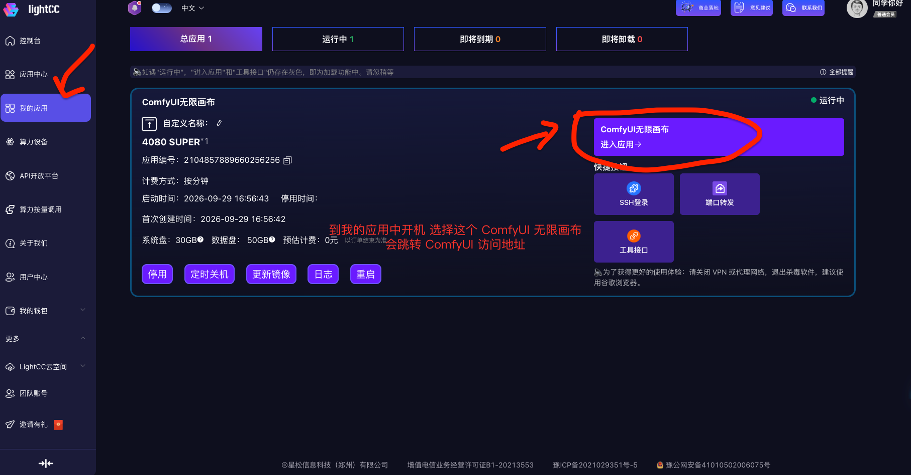
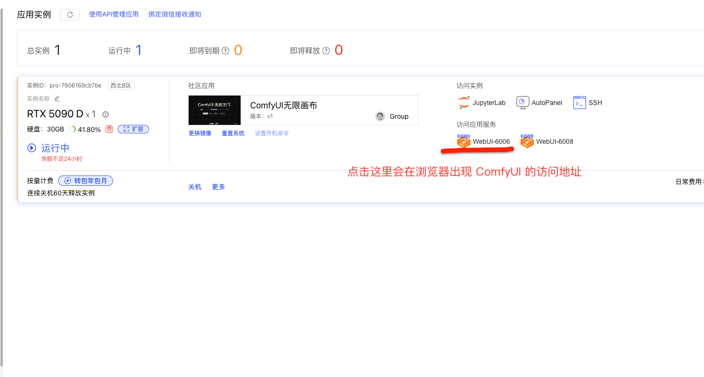
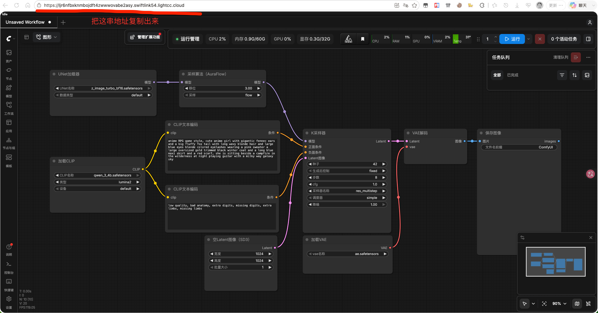
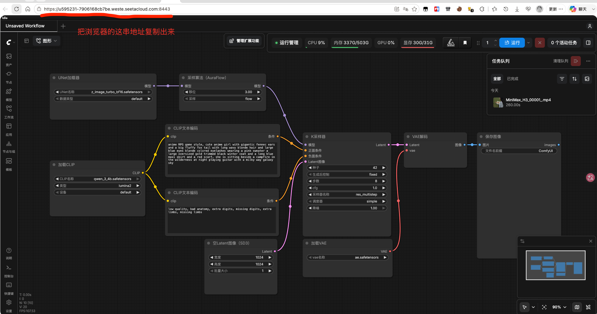
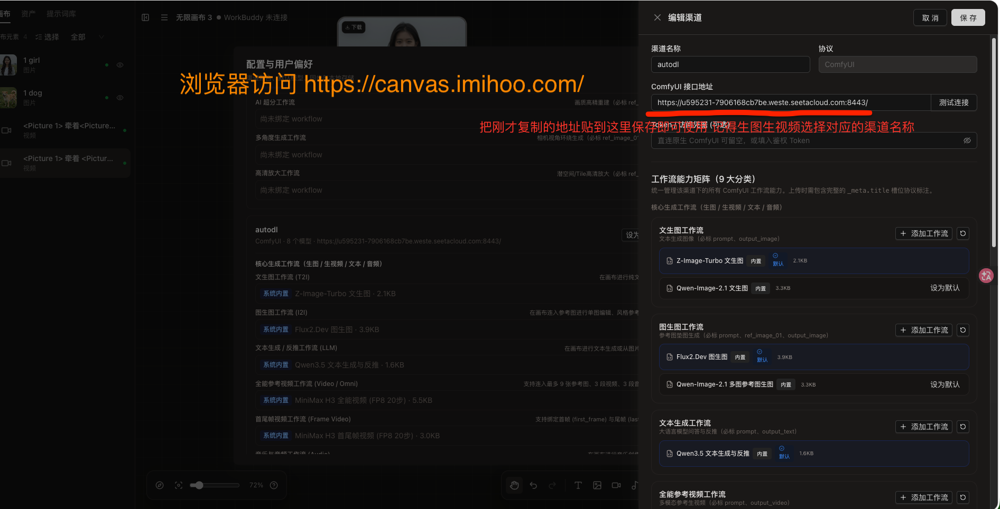

<p align="center">
  
</p>

<h1 align="center">无限画布 (infinite-canvas::ComfyUI)</h1>

<p align="center">
  <a href="https://github.com/ZhuYichuan/infinite-canvas"></a>
  <a href="LICENSE"></a>
  <a href="https://vite.dev/"></a>
  <a href="https://reactrouter.com/"></a>
  <a href="https://comfyui.com/"></a>
</p>

<p align="center">
  <a href="docs/content/docs/overview/features.zh-CN.mdx">功能介绍</a> · <a href="docs/content/docs/overview/quick-start.zh-CN.mdx">快速开始</a> · <a href="docs/CLOUD_MIRROR_GUIDE.md">云端镜像免配置指南</a> · <a href="DEPLOY.md">部署与发布</a> · <a href="docs/COMFYUI_WORKFLOW_GUIDE.md">ComfyUI 工作流配置指南</a> · <a href="docs/comfyui-channel.md">ComfyUI 渠道说明</a> · <a href="docs/content/docs/development/comfyui-workflow-standard.zh-CN.mdx">工作流标准规范</a> · <a href="docs/content/docs/progress/todo.mdx">待办事项</a>
</p>

<blockquote align="center">
  ☕ <b>请作者喝杯咖啡</b> · <sub>创作与打磨不易，若对你的创作有所帮助，欢迎支持持续维护</sub><br><br>
  <sub><i>本项目由维护者在业余时间独立持续迭代，从 ComfyUI 原生 API 深度适配、工作流动态槽位驱动，到云端预装镜像搭建与文档梳理，背后倾注了大量心血。<br>如果无限画布曾让你的 AI 创作更顺畅、为你节省了环境配置时间，非常感谢你的每一份真诚支持，这是开源路上最温暖的动力！</i></sub><br><br>
  <table align="center">
    <tr>
      <td align="center" width="130">
        <br>
        <sub><b>微信支付</b></sub>
      </td>
      <td align="center" width="130">
        <br>
        <sub><b>支付宝</b></sub>
      </td>
    </tr>
  </table>
</blockquote>

## 关于本项目

本项目基于原项目 [basketikun/infinite-canvas](https://github.com/basketikun/infinite-canvas) fork 而来，在此向原作者 [basketikun](https://github.com/basketikun) 致以诚挚的感谢！

本项目是一个专注于 **ComfyUI** 的分支版本，与原项目的主要区别：

- **仅支持 ComfyUI**：生成渠道已全面收敛为本地自建 ComfyUI（默认 `http://127.0.0.1:8188`），浏览器前端直连 ComfyUI 官方 REST / WebSocket 端点，已移除 OpenAI、Gemini 等外部商用大模型 API 及早期 `comfy-api-proxy` 中间代理。
- **工作流驱动 UI**：画布节点的参数控件完全由绑定的 ComfyUI 工作流槽位（`_meta.title`）动态决定，未标记的槽位不在 UI 上显示。
- **内置开箱即用工作流**：内置文生图、图生图、局部重绘、文本/反推、全能参考视频、首尾帧视频等常用工作流，也可随时上传自定义工作流。

无限画布是一款面向 AI 创作的开源可视化工作台：画布编排、AI 生图 / 视频生成、参考图编辑、Agent 智能助手、提示词库与素材管理都集中在同一个界面里，适合连续探索与迭代视觉方案。

## 核心功能

- 无限画布：多画布项目、节点拖拽缩放、连线、小地图、撤销重做、导入导出。
- ComfyUI 生成：文生图（T2I）、图生图（I2I）、局部重绘、全能参考视频、首尾帧视频等，能力由工作流槽位决定。
- 画布助手：围绕选中节点与上游节点对话、生成，并把结果插回画布。
- 本地 Agent：通过本机 Canvas Agent 连接 Codex / Claude Code，让 Agent 通过 MCP 操作当前画布；提供 Codex App 插件。
- 插件系统：支持通过 URL 动态安装 / 启用 / 更新 / 卸载远程节点插件，并提供 TypeScript SDK 开发画布节点插件。
- 提示词库：浏览器前端直连多个 GitHub 开源项目，并缓存到 IndexedDB。
- 纯前端架构：画布、素材、生成记录与 ComfyUI 访问凭据（如可选 Token）均保存在浏览器本地，无服务端依赖。

完整功能说明见 [功能介绍](docs/content/docs/overview/features.zh-CN.mdx)。

## 快速开始

### 前置条件

- **方式一（推荐：云端镜像免本地配置）**：直接使用作者在 [LightCC（首选推荐，新用户送 3 元券可免费体验 5090 1小时）](https://www.lightcc.cloud/imageDetail?id=75064&invitationCode=yKBHXCJF108947) 或 [AutoDL](https://www.autodl.art/app/market/305?v=932) 提供的官方预装镜像一键开机，免去本地显卡、Python、CUDA 与庞大模型下载。详见下方 [使用云端镜像免本地配置](#-使用云端镜像免本地配置)。
- **方式二（本地自建 ComfyUI）**：本机（或局域网）已运行 ComfyUI，默认地址 `http://127.0.0.1:8188`，浏览器能访问该地址（CORS / 网络策略需放通，详见渠道文档）。

### 本地开发

```bash
git clone git@github.com:ZhuYichuan/infinite-canvas.git
cd infinite-canvas/web
bun install
bun run dev
```

启动后访问 `http://localhost:3000`。

### Docker 运行

```bash
git clone git@github.com:ZhuYichuan/infinite-canvas.git
cd infinite-canvas
docker compose up -d
```

运行后默认端口 3000，可访问 `http://localhost:3000`。

## ☁️ 使用云端镜像免本地配置

> [!TIP]
> **🚀 使用云端镜像免本地配置（强烈推荐）**
> 无需本地高性能独立显卡，免去繁琐配置 Python / CUDA 环境与下载数十 GB 模型文件的漫长等待！本项目已上架开箱即用的预装镜像，**首选推荐使用 LightCC 平台**（🎁 **新用户注册即送 3 元优惠券，可免费体验 RTX 5090 算力 1 个小时！**），同时也支持 AutoDL。开机后仅需复制地址填入画布即可直接使用。

| 平台 | 镜像一键开机地址 | 推荐度与特点 |
| :--- | :--- | :--- |
| **LightCC** | [LightCC 官方镜像入口](https://www.lightcc.cloud/imageDetail?id=75064&invitationCode=yKBHXCJF108947) | **⭐ 首选推荐** · 🎁 送 3 元券（免费体验 5090 1小时）、按量计费、极速启动、一键进入应用 |
| **AutoDL** | [AutoDL 官方镜像入口](https://www.autodl.art/app/market/305?v=932) | 备选支持 · 算力丰富、多显卡型号可选、稳定可靠 |

📖 **完整图文指南**：[云端镜像免本地配置完整手册 (docs/CLOUD_MIRROR_GUIDE.md)](docs/CLOUD_MIRROR_GUIDE.md)

### 3 步极速接入流程

#### 1. 到云端找到镜像，选择机器开机并点击访问入口
- **LightCC（首选推荐）**：开机后在「我的应用」中找到「ComfyUI无限画布」，点击 **「进入应用 →」**。
- **AutoDL**：开机后在应用实例列表「访问应用服务」一栏点击 **WebUI-6006**。

<table width="100%">
  <tr>
    <td width="50%" align="center"><b>LightCC 开机点击进入应用（推荐）</b></td>
    <td width="50%" align="center"><b>AutoDL 开机点击 WebUI-6006</b></td>
  </tr>
  <tr>
    <td width="50%"></td>
    <td width="50%"></td>
  </tr>
</table>

#### 2. 点击访问地址，并从浏览器中复制出来
在新打开的 ComfyUI 页面中，直接复制浏览器地址栏的完整 URL（包含域名与端口）：

<table width="100%">
  <tr>
    <td width="50%" align="center"><b>复制 LightCC 浏览器访问地址（推荐）</b></td>
    <td width="50%" align="center"><b>复制 AutoDL 浏览器访问地址</b></td>
  </tr>
  <tr>
    <td width="50%"></td>
    <td width="50%"></td>
  </tr>
</table>

#### 3. 到画布页面配置 ComfyUI 地址
1. 打开无限画布（支持直接访问官方线上体验版 [https://canvas.imihoo.com](https://canvas.imihoo.com/) 或本地部署的 `http://localhost:3000`）。
2. 点击右上角配置图标打开「配置与用户偏好」，在「渠道设置」中新建或编辑 ComfyUI 渠道。
3. 填入「渠道名称」（如 `autodl` 或 `lightcc`），将上一步复制的地址粘贴到 **「ComfyUI 接口地址」** 输入框中，点击「测试连接」成功后保存。
4. 返回画布，在生成图片或视频时选择刚刚配置好的渠道名称，即可直接运行生成！

<p align="center">
  
</p>

## ComfyUI 配置

首次打开后进入右上角「配置」，新建一个 `API 格式` 为 **ComfyUI** 的渠道，填写 ComfyUI 地址（如本地默认 `http://127.0.0.1:8188`，或上述云端镜像地址）与凭据，即可在画布中使用内置工作流；也可以上传自定义工作流。

- [云端镜像免本地配置指南](docs/CLOUD_MIRROR_GUIDE.md)：AutoDL / LightCC 官方镜像开机取址与接入步骤。
- [ComfyUI 工作流配置指南（用户上传工作流必读）](docs/COMFYUI_WORKFLOW_GUIDE.md)：槽位词汇表、`_meta.title` 标注约定、上传与排错。
- [ComfyUI 渠道说明](docs/comfyui-channel.md)：架构、协议、限制与调试技巧。
- [工作流标准规范（开发向）](docs/content/docs/development/comfyui-workflow-standard.zh-CN.mdx)：能力矩阵、槽位契约、输入探测规则。
- [多模态参考视频规格](docs/content/docs/development/multimodal-video-workflow-spec.zh-CN.mdx)：全能参考视频（MiniMax H3）尺寸锁死与资源连线规则（最多 9 图 + 3 视频 + 3 音频）。

## 效果展示

<table width="100%">
  <tr>
    <td width="50%"></td>
    <td width="50%"></td>
  </tr>
  <tr>
    <td width="50%"></td>
    <td width="50%"></td>
  </tr>
  <tr>
    <td width="50%"></td>
    <td width="50%"></td>
  </tr>
  <tr>
    <td width="50%"></td>
    <td width="50%"></td>
  </tr>
</table>

## 联系方式

| | 联系方式 |
| --- | --- |
| 本分支维护者 | 邮箱：916446339@qq.com · 电话：18656460515 · 抖音： |
| ☕ 赞助支持 | 创作不易，欢迎[请作者喝杯咖啡](#关于本项目)（支持微信支付 / 支付宝） |

## 开源协议

本项目使用 [MIT License](LICENSE)，感谢原作者的开源贡献；二次开发与 PR 请保留原作者信息和前端页面标识。
