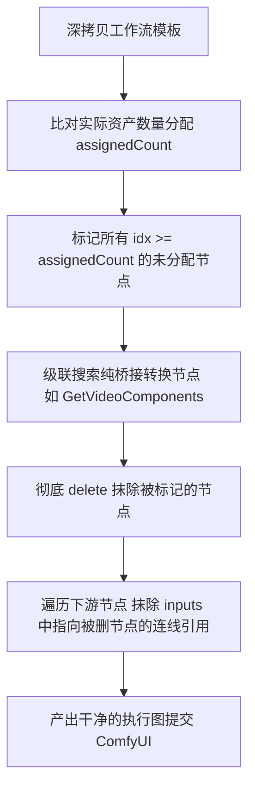

# 全能参考视频生成需求规格说明书 (Spec)

## 1. 背景与目标

### 1.1 业务背景
本项目已全面精简渠道，仅支持本地或局域网自建的 ComfyUI。随着视频生成大模型向“多模态长参考”演进，以 **MiniMax H3** 为代表的模型支持高精度的多图、多视频、多音频长上下文参考。

### 1.2 核心痛点
1. **硬件与架构尺寸锁死**：底层扩散网络（Patch / VAE / 空间注意力）对输入分辨率有严格的 32 整数倍对齐要求，且最大显存承载存在上限。若开放任意自由输入，会导致张量尺寸不匹配报错或画面严重畸变。
2. **多模态参考插槽复杂度高**：模型支持最多 9 张参考图、3 个参考视频、3 个参考音频，参数繁杂，需做到“预设即工具卡片”，无需用户面对庞大的底层参数表单。
3. **连线数量不确定与脏数据污染**：用户实际连线数量不可预知（可能只连 1 张图，或纯文生视频 0 张图）。若保留未指派的节点，模板中写死的测试文件名会触发 `FileNotFoundError` 或画面被测试图污染。

### 1.3 建设目标
打造一套高可靠、开箱即用的全能参考视频生成链路：
* **尺寸硬件级锁死**：移除自由输入，锁定 16:9 与 9:16 对称互换，锁定 9 档硬件尺寸（上限 0.98 MP）；
* **多模态全能连线**：画布一键连入图片、视频、音频，按连线先后顺序（FIFO）自动分配插槽；
* **动态级联修剪 (Pruning)**：未分配的参考节点及其中间转换节点自动从工作流中彻底抹除并抹平连线；
* **严格防呆拦截 (Fail-loud)**：超出插槽承载上限的连线即刻显式报错阻断，拒绝静默丢弃素材。

---

## 2. 界面与交互规格 (UI Spec)

### 2.1 尺寸规格：16:9 / 9:16 对称对调与 9 档锁死预设

面板彻底移除原有的自由数字输入框（W / H 输入），仅提供两档固定比例与 9 档硬件严格对齐的离散尺寸。

| 档位 (Megapixels) | 横屏 16:9 (`width x height`) | 竖屏 9:16 (`width x height`) | 32 倍数校验 | 说明 |
| :---: | :---: | :---: | :---: | :---: |
| **0.2 MP** | `608 x 352` | `352 x 608` | 19 x 11 | 超低显存快速预览 |
| **0.3 MP** | `736 x 416` | `416 x 736` | 23 x 13 | 低显存档位 |
| **0.4 MP** | `864 x 480` | `480 x 864` | 27 x 15 | 标清档位 |
| **0.5 MP** | `960 x 544` | `544 x 960` | 30 x 17 | **系统推荐默认档位** |
| **0.6 MP** | `1056 x 608` | `608 x 1056` | 33 x 19 | 中高画质 |
| **0.7 MP** | `1152 x 640` | `640 x 1152` | 36 x 20 | 高画质 |
| **0.8 MP** | `1216 x 672` | `672 x 1216` | 38 x 21 | 超清画质 |
| **0.9 MP** | `1280 x 736` | `736 x 1280` | 40 x 23 | 准 1K 高清 |
| **0.98 MP** | `1344 x 768` | `768 x 1344` | 42 x 24 | **系统允许的最大上限** |

> **约束说明**：1.0 MP ~ 2.0 MP 档位在底层模型中会导致爆显存或超时，前端**完全封禁**，最大上限严格锁死在 0.98 MP。

### 2.2 交互行为规则
1. **尺寸直观呈现**：规格卡片上优先以**大字直接展示当前真实宽高像素**（如 `960 × 544`），副文案紧凑显示档位（如 `0.5M`）。
2. **动态对称互换**：
   * 点击「16:9 横屏」按钮：当前选中的档位切换为长宽比 `landscapeW x landscapeH`，9 个卡片的文本全部刷新为横屏像素；
   * 点击「9:16 竖屏」按钮：当前选中的档位切换为宽高对调 `landscapeH x landscapeW`，9 个卡片的文本全部刷新为竖屏像素。
3. **按钮显示简化**：画布节点浮层按钮格式收敛为：`{width}×{height} ({aspect}) · {duration}s`（如 `544×960 (9:16) · 5s`）。

---

## 3. 工作流槽位与路由契约 (Slot Routing Contract)

### 3.1 词汇表与节点标注

工作流模板文件：`Comfy/Comfy-Api/workflows/5_video_minimax_h3_omni/minimax_h3_ref2va_fp8_20step_api.json`

| 槽位保留名 | 允许节点类型 | 目标字段 | 容量 | 作用说明 |
|---|---|---|---|---|
| `prompt` | `PrimitiveStringMultiline` | `inputs.value` | 1 | 核心正向提示词，连入节点 19 的 `prompt` |
| `seed` | `PrimitiveInt` | `inputs.value` | 1 | 随机噪波种子，连入节点 15 的 `noise_seed` |
| `width` | `Int` / `PrimitiveInt` | `inputs.Number` | 1 | 像素宽度，连入节点 19 的 `width` |
| `height` | `Int` / `PrimitiveInt` | `inputs.Number` | 1 | 像素高度，连入节点 19 的 `height` |
| `duration` | `PrimitiveFloat` | `inputs.value` | 1 | 视频秒数，经节点 17 表达式转换为帧长传入节点 19 |
| `ref_image_01` ~ `09` | `LoadImage` | `inputs.image` | 9 | 参考图片插槽 1 到 9 |
| `ref_video_01` ~ `03` | `LoadVideo` | `inputs.file` | 3 | 参考视频插槽 1 到 3（经 `GetVideoComponents` 连入节点 19） |
| `ref_audio_01` ~ `03` | `LoadAudio` | `inputs.audio` | 3 | 参考音频插槽 1 到 3（直接连入节点 19） |

### 3.2 路由与超额拦截规则
* **自动按连线先后（FIFO）路由**：
  * 画布收集到的图片列表 `referenceImages`，按 index 依次分配给 `ref_image_01`、`ref_image_02`...；
  * 画布收集到的视频列表 `referenceVideos`，按 index 依次分配给 `ref_video_01`、`ref_video_02`...；
  * 画布收集到的音频列表 `referenceAudios`，按 index 依次分配给 `ref_audio_01`、`ref_audio_02`...。
* **严格拦截（Fail-loud）**：
  若连入素材超过插槽容量上限，提交前直接抛出异常拦截并友好提示：
  * 图片 > 9：`当前视频工作流最多支持 9 张参考图，已连接 N 张，请精简连线后再生成`
  * 视频 > 3：`当前视频工作流最多支持 3 个参考视频，已连接 N 个，请精简连线后再生成`
  * 音频 > 3：`当前视频工作流最多支持 3 个参考音频，已连接 N 个，请精简连线后再生成`

---

## 4. 动态修剪算法规格 (Dynamic Pruning)

为避免未连满的插槽残留默认文件名导致 ComfyUI 执行报错，系统在深拷贝工作流模板后执行**全自动级联修剪**：

### 4.1 修剪行为矩阵
1. **未分配插槽抹除**：若用户上传了 M 张图（M < 9），则 `ref_image_{M+1}` 至 `ref_image_09` 全部从工作流中删除。
2. **级联桥接抹除**：若某个 `LoadVideo` 节点被抹除，其下游专门负责解包的 `GetVideoComponents` 节点连带抹除。
3. **输入引用抹平**：遍历核心生成节点（节点 19），将其 `inputs["ref_images.ref_image_*"]`、`inputs["ref_videos.ref_video_*"]` 和 `inputs["ref_audios.ref_audio_*"]` 中引用了被删节点的键值彻底删除。
4. **纯文生视频场景**：当未连接任何素材时，9 图、3 视频、3 音频共 18 个节点及其桥接节点全部抹除，以纯粹文本模式安全提交。

---

## 5. 产物提取与存储链路规格

1. **产物捕获**：不强求将 `SaveVideo` 节点重命名为 `output_video`。ComfyUI 服务端在任务完成时，轮询接口通过响应报文的 `outputs` 字段自动汇总所有产生视频的节点产物。
2. **下载与落库**：前端直接通过 `collectVideoAssetIds` 抓取输出产物并下载为 Blob，落入浏览器本地持久化存储（`uploadMediaFile`），最后将 URL 回写到画布视频节点的 `metadata.content`。
3. **超时断点续查 (Resume Polling)**：任务在向 ComfyUI 提交成功后立刻在节点元数据中持久化记录 `jobId`。若因本地显卡耗时过长发生超时，节点进入带有 `isTimeout: true` 标记的状态，操作按钮自动转为「继续查询」；点击后直接基于已有 `jobId` 恢复轮询等待结果，免除重复提交与排队算力浪费。

---

## 6. 验收与测试用例矩阵 (Test Matrix)

| 用例 ID | 测试场景 | 前置条件 / 输入 | 预期行为 |
|:---:|---|---|---|
| **TC-01** | **纯文本生视频** | 视频节点无任何图片/音视频连线，仅输入 Prompt | 9 图 3 视频 3 音频节点全部被自动修剪抹除，ComfyUI 纯文本生成成功 |
| **TC-02** | **单参考图生视频** | 连接 1 张图片节点 | `ref_image_01` 成功注入，其余 8 图及音视频节点自动抹除，顺利生成 |
| **TC-03** | **多图参考生视频** | 连接 3 张图片节点 | 前 3 张图按连线顺序分别注入 01~03，其余节点抹除，顺利生成 |
| **TC-04** | **全模态参考生视频** | 同时连接 2 张图片、1 个视频、1 个音频 | 自动上传图片、视频、音频资产，分别注入 01 号对应插槽，顺利生成 |
| **TC-05** | **图片连线超额拦截** | 连接 10 张图片节点 | 点击生成即刻弹窗报错提示最多支持 9 张，阻止向 ComfyUI 发送请求 |
| **TC-06** | **尺寸横竖屏动态切换** | 切换 16:9 与 9:16，并选择 0.98M | 卡片数值即时互换，Node 147 注入 1344（横）或 768（竖），无偏差 |
