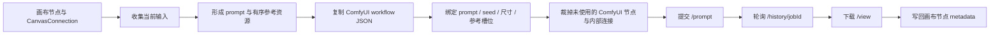

# 画布生成链路现状梳理

> 文档性质：当前实现事实梳理，不是目标方案，不代表已经决定的产品规则  
> 覆盖范围：画布节点、图片生成、视频生成、文本/音频辅助链路、提示词、`@` 引用、重试、下游再生成、ComfyUI 提交与状态持久化  
> 核对基线：`main` / `v0.17.0` / `e21a4e0896a2150811fe7773be7f9bc48a04986c`  
> 核对方式：以当前源码为准，结合项目内设计文档，并对本地 `http://127.0.0.1:3000` 做只读页面检查；未创建画布、未发起生成、未修改业务代码

---

## 1. 先给结论

当前画布不是一套“节点变更后自动向下游执行”的工作流引擎，而是一套“用户手动选择节点并执行一次生成”的画布。

最重要的结论如下：

1. **画布连线不会在重新生成前自动拆除。**
2. **画布连线不会在生成成功后自动拆除。**
3. **失败节点点“重试”时，结果写回原节点，节点 ID 和所有画布连线保持不变。**
4. **成功节点再次点“生成”时，通常不是覆盖原节点，而是创建一个新结果节点，并追加一条“原节点 → 新结果节点”的连线。**
5. **下游节点不会因为上游重新生成而自动重新生成，也没有“已过期 / dirty”标记。**
6. **真正存在的“自动拆连接”发生在 ComfyUI 工作流内部：提交前会复制工作流，并裁掉没有分配资源的参考节点及其级联连线。它不会改动画布连线。**
7. **普通节点提示框和 Config 编排器中的 `@` 不是同一套协议。**普通提示框保存本地化位置标签，Config 编排器保存稳定的节点 ID token。
8. **同一条画布连线同时承担了“输入依赖”和“生成血缘”两种语义。**这是当前重新生成、参考图选择和下游行为容易互相干扰的根源。

可以把当前行为先概括成下面这张表：

| 用户动作 | 节点处理 | 画布连线处理 | 下游处理 |
| --- | --- | --- | --- |
| 空图片/视频/文本/音频节点首次生成 | 写回原节点 | 不新增、不删除 | 不自动执行 |
| Config 或已有内容节点再次“生成” | 通常创建新结果节点 | 追加“当前节点 → 新结果” | 不自动执行 |
| 失败节点“重试” | 覆盖原失败节点 | 不新增、不删除 | 不自动执行 |
| 超时节点“重新查询” | 使用已有 `jobId` 继续查询 | 不新增、不删除 | 不自动执行 |
| 生成成功 | 更新结果与状态 | 不拆线 | 不自动执行 |
| 手动删除参考 | 不改节点 | 删除指定 `from → to` 连线 | 后续手动生成才使用新输入 |
| ComfyUI 提交前裁剪 | 不改画布节点 | 不改画布连线，只改工作流副本 | 无 |

---

## 2. 必须先区分的四个概念

### 2.1 画布节点

节点的业务数据都放在扁平的 `metadata` 中，常见字段包括：

- 原始输入：`prompt`、`composerContent`
- 本次解析后的输入：`effectivePrompt`
- 结果：`content`、`storageKey`、`mimeType`
- 状态：`idle | loading | success | error`
- 任务：`jobId`、`isTimeout`
- 生成参数：`model`、`size`、`quality`、`seed`、`seconds`、`videoMode` 等
- 图片重试快照：`generationType`、`references`
- 批量结果：`images[]`、`texts[]`、`primaryImageId`、`primaryTextId`

### 2.2 画布连线

当前 `CanvasConnection` 只有三个字段：

```text
id / fromNodeId / toNodeId
```

它没有以下信息：

- 连线类型是“输入依赖”还是“生成血缘”；
- 输入端口是什么；
- 是首帧、尾帧，还是第几个参考图；
- 是否锁定某次生成快照；
- 上游变更后下游是否已过期。

因此，代码只能根据节点类型、方向和数组顺序临时推断连线含义。

### 2.3 一次生成运行

当前没有独立、完整的 `GenerationRun` 实体。一次运行的信息分散在节点 `metadata`、全局配置、当前连线和 ComfyUI `jobId` 中。

这意味着“当时到底用了什么”并不总能完整重放：

- 图片保存了较多生成参数和图片引用快照；
- 视频虽然保存了 `references` 用于记录，但重试时没有从这里恢复输入；
- 文本、音频更多依赖当前节点和当前连线；
- `effectivePrompt` 虽然生成时会保存，但图片重试优先使用的是原始 `prompt`。

### 2.4 ComfyUI 工作流内部连接

ComfyUI workflow JSON 自身也有节点和连接。它与画布的 `CanvasConnection` 是两个完全独立的图：



本文后面说“画布拆线”时，指 `CanvasConnection`；说“工作流裁剪”时，指 ComfyUI JSON 内部节点和连接。

---

## 3. 当前输入是怎么从连线中取出来的

### 3.1 普通节点：只取直接入边

普通情况下，生成节点只读取：

```text
所有 toNodeId === 当前节点 ID 的直接上游节点
```

只有具备实际资源的节点会成为输入：

- 图片节点必须已有图片内容；
- 视频节点必须已有视频内容；
- 音频节点必须已有音频内容；
- 文本节点必须有 `content` 或 `prompt`；
- 插件节点必须通过节点定义声明自己能输出某类资源；
- 空节点不会作为参考资源。

当前资源解析是**一跳读取**，不会沿整张图递归收集祖先资源。

### 3.2 Config 的特殊“兄弟输入”规则

如果正在生成的节点有一条出边连到 Config，系统会把该 Config 的其他入边当成当前节点的生成上下文。

例如：

```text
图片 A ─┐
文本 T ─┼─> Config C
视频 V ─┘
```

当从图片 A 发起生成时，输入解析会优先找到 A → C，然后把 C 的其他输入 T、V 返回给 A；A 自己被排除。

图片生成稍后还会额外把 A 本身放回参考图第一位，因此最终可能是：

```text
prompt 使用 T
referenceImages = [A]
referenceVideos = [V]
```

这是当前 Config 能充当“汇总输入卡片”的核心机制，但它不是显式端口模型，而是根据连线方向临时推断。

### 3.3 Config 的出边与普通节点出边并不对称

UI 中 Config 没有普通右侧 source handle，但生成结果仍会由程序自动添加：

```text
Config → 生成结果
```

所以视觉交互上 Config 更像“只接收输入”，数据上却仍然拥有生成结果出边。

### 3.4 Group 的处理

Group 是虚拟容器，不保存 `children[]`。子节点通过 `metadata.groupId === group.id` 反向归属。

当 Group 被接入生成节点时，系统会把组内直接资源子节点展开，并按节点 ID 去重。

需要注意：当前实现只读取**直接归属该 Group 的资源节点**，没有递归展开嵌套 Group。项目旧说明中若写成“递归解包”，与当前实现不一致。

### 3.5 输入顺序

普通模式的资源顺序主要来自：

1. `connections` 数组中的连线插入顺序；
2. Group 子节点在 `nodes` 数组中的顺序；
3. 去重后第一次出现的位置。

当前画布没有一个清晰的“参考资源排序器”。用户删除再重连，可能改变顺序；而顺序会直接影响：

- `图片1 / 图片2` 等标签；
- ComfyUI 的 `ref_image_01 / ref_image_02`；
- 视频首帧、尾帧；
- 多模态视频的图片、视频、音频插槽顺序。

---

## 4. 提示词与 `@` 的实际处理

当前至少存在两套主要 `@` 协议，外加文本节点编辑中的相似输入组件。

## 4.1 普通节点提示框：保存“显示标签”

普通节点面板使用 `CanvasPromptChipInput`。

用户在 UI 里选择一个资源后，编辑器显示 chip；保存回节点时，不保存节点 ID，而是保存本地化的位置标签，例如：

```text
图片1
文本1
视频参考 1
音频参考 1
```

这里的关键行为是：

### 对图片、视频、音频

- `@` 标签只是提示词中的语义标记；
- 所有通过连线收集到的媒体资源都会进入请求；
- 是否在提示词中写了 `图片1`，不会决定这张图是否上传；
- 从提示词里删掉 `图片1`，不会删除画布连线，也不会排除该图片；
- 真正排除资源必须手动断开连线。

例如：

```text
图片 A → Config C
图片 B → Config C
prompt = “让图片1的角色采用图片2的服装”
```

请求中会上传 A、B；标签只帮助模型理解两张图片在自然语言中的角色。

### 对文本

文本资源会被真正展开到提示词中。系统会尝试匹配：

1. `@[node:<id>]`；
2. 当前顺序生成的默认标签，例如 `文本1`；
3. 文本节点标题。

匹配后用文本节点内容替换；如果某个已连接文本完全没有在 prompt 中被消费，就自动在 prompt 末尾用空行追加。

因此普通模式里：

- 媒体默认“连上就全部发送”；
- 文本默认“提到就原位展开，没提到也追加”。

### 普通标签协议的风险

- 标签依赖语言环境，切换语言后保存值与当前候选标签可能不一致；
- 标签依赖连接顺序，重连后 `图片1` 可能指向另一张图；
- 编辑器按纯文本匹配标签，普通句子中恰好出现同名文本也可能被渲染成 chip；
- 标签本身不携带稳定身份，无法证明当时对应哪个节点。

## 4.2 Config 编排器：保存稳定的节点 ID token

Config 的 `CanvasConfigComposer` 保存的是：

```text
@[node:<nodeId>]
```

例如：

```text
让 @[node:image-a] 的人物使用 @[node:image-b] 的构图，参考 @[node:text-c]
```

只要 `composerContent.trim()` 非空，就进入 Config 专用解析模式。

该模式的行为是：

1. 按 token 在提示词中第一次出现的顺序读取资源；
2. 文本 token 原位替换成文本内容；
3. 图片、视频、音频 token 改写为本地化位置标签；
4. 只有被 token 点名的媒体才会进入请求；
5. 同一个媒体重复提及，只上传一次；
6. 同一个文本重复提及，会在每个位置重复展开；
7. Group token 会展开为组内直接资源；
8. token 指向未连接或不存在的节点时，该 token 会被静默移除。

一个非常重要的边界：

> Config 已经连了很多资源，但 `composerContent` 中没有任何 token 时，最终请求会使用纯 prompt，所有已连接媒体都被忽略。

这与普通提示框“连上就全部发送”的规则正好相反。

## 4.3 两套 `@` 规则的对比

| 维度 | 普通节点提示框 | Config 编排器 |
| --- | --- | --- |
| 持久化值 | 本地化位置标签 | `@[node:<id>]` |
| 是否稳定绑定节点 | 否 | 是 |
| 媒体选择权 | 连线决定，prompt 不决定 | token 决定 |
| 删除 chip 的效果 | 只删文字，不断线、不排除资源 | 删 token 后该媒体不再进入请求，但连线仍保留 |
| 未提及媒体 | 仍全部发送 | 全部忽略 |
| 未提及文本 | 自动追加 | 不发送 |
| 断开的 token | 通常变成普通文本/失配 | 解析时静默删除 |
| 顺序来源 | 连线顺序 | token 第一次出现顺序 |

## 4.4 当前 `prompt` 与 `effectivePrompt`

生成时通常会同时保存：

- `prompt`：用户输入的原始内容；
- `effectivePrompt`：文本引用已展开、媒体引用已重标号后，真正提交给服务层的内容。

但“保存了”不等于“重试时使用”：

- 图片生成后的重试优先取原始 `prompt`；
- 它不会重新使用保存的 `effectivePrompt`；
- Config 原始 prompt 中若含 `@[node:id]`，图片重试可能把这个原始 token 直接发给 ComfyUI；
- 普通 prompt 若依赖 `文本1` 的替换，图片重试也可能失去当时展开后的文本内容。

所以目前 `effectivePrompt` 更像追踪信息，还不是统一的可重放输入。

---

## 5. “生成”动作的完整节点行为

## 5.1 生成入口

手动点击生成和 Agent 的 `run_generation` 最终都会进入同一个核心入口 `handleGenerateNode`。

入口大致执行：

1. 读取当前节点；
2. 合并全局配置和节点配置；
3. 构建当前连线对应的生成上下文；
4. 将资源解析为 prompt、图片、视频、音频；
5. 决定写回原节点还是创建新节点；
6. 发起 ComfyUI 请求；
7. 将 `jobId`、成功结果或错误写回节点。

空 prompt 的限制并不统一：文本和音频要求 prompt 非空；图片和视频可以在有参考资源等情况下继续进入请求。

## 5.2 写回还是新建

| 来源节点状态/类型 | 图片模式 | 视频模式 | 文本模式 | 音频模式 |
| --- | --- | --- | --- | --- |
| 对应类型的空节点 | 写回原 ID | 写回原 ID | 写回原 ID | 写回原 ID |
| Config | 新建结果 | 新建结果 | 新建结果 | 新建结果 |
| 已有内容的图片 | 新建图片子节点 | 新建视频子节点 | 新建文本子节点 | 新建音频子节点 |
| 已有内容的视频 | 新建图片子节点 | 新建视频子节点 | 新建文本子节点 | 新建音频子节点 |
| 已有内容的文本 | 新建图片子节点 | 新建视频子节点 | 新建修订文本子节点 | 新建音频子节点 |
| 已有内容的音频 | 新建图片子节点 | 新建视频子节点 | 新建文本子节点 | 新建音频子节点 |

只要创建新节点，就立即追加：

```text
来源节点 → 新结果节点
```

这条线既被当作“结果由谁产生”的血缘线，也可能在以后被当作新结果节点的输入线。

## 5.3 插件节点例外

如果插件节点声明 `useBuiltinPanel.writeBackToSelf` 且使用内置图片生成面板，结果会写回插件节点自身，不创建普通图片子节点，也不新增结果连线。

---

## 6. 图片生成链路

## 6.1 参考图如何形成

图片模式先读取连线得到的 `generationContext.referenceImages`。

如果发起生成的节点本身是一个已有内容的图片节点，还会把这张图片额外放到参考图第一位：

```text
referenceImages = 去重([当前图片自身, 连线解析出的图片])
```

所以：

- 没有参考图：走文生图；
- 只要存在参考图：走图生图 / edit；
- 当前成功图片再次生成时，天然会把自己作为第一参考图；
- 去重依据是引用对象的 `id`。

## 6.2 图片节点血缘线会反过来成为输入

例如：

```text
A --生成--> B
```

这条 A → B 原本表达“B 由 A 生成”。但当用户再从 B 生图时：

1. B 自身会被放到参考图第一位；
2. A 又因为是 B 的直接入边，被当成连线参考；
3. 最终可能得到 `[B, A]` 两张参考图。

也就是说，图片链越向下再次生成，祖先的最近一层可能被意外重新带入。当前没有“这条边只是血缘，不应作为输入”的区分。

## 6.3 多图批量生成

画布批量图片生成的结构是：

- 创建一个图片根节点；
- 根节点 `metadata.images[]` 创建 N 个槽位；
- N 个槽位并行发起 N 个独立的单图 ComfyUI 任务；
- 只创建一条“来源 → 图片根节点”的线；
- 第一个成功结果成为主图；
- 部分失败时，成功图保留，失败槽位可单独重试。

当前画布 `count` 会限制在 1～15。

### 批量任务的 `jobId` 风险

每个并行槽位都有自己的 ComfyUI `jobId`，但 `CanvasNodeImage` 槽位结构没有 `jobId` 字段，所有槽位共同写根节点的一个 `metadata.jobId`。后写入的任务会覆盖先写入的任务。

因此，批量图片某个槽位超时后点“重新查询”，可能拿根节点最后记录的另一个槽位 `jobId` 去查询。这不是严格的一槽一任务映射。

## 6.4 ComfyUI 图片请求

服务层会：

1. 根据是否有参考图选择 T2I 或 I2I workflow；
2. 检查工作流中 `_meta.title` 标出的参考图槽位；
3. 没有槽位却传了参考图时显式报错；
4. 参考图数量超过槽位数量时显式报错；
5. 将参考图逐张上传到 `/upload/image`；
6. 绑定 prompt、width、height、seed、`ref_image_01..09`；
7. 裁剪未使用的参考分支；
8. 提交 `/prompt`；
9. 轮询 `/history/{jobId}`；
10. 从 `/view` 下载并存入浏览器本地文件存储；
11. 画布节点只保存可恢复的 `storageKey` 等指针。

---

## 7. 视频生成链路

## 7.1 视频不会自动把自己作为视频参考

成功图片再次生图时会自动把自己作为第一张参考图；成功视频再次生视频时，没有对应的“把当前视频自身放入 `referenceVideos`”逻辑。

因此从一个已有视频节点点击视频生成：

- 若它没有其他有效入边，可能仍是纯 prompt 视频生成；
- 当前视频本身不一定作为参考视频上传；
- 只有当前上下文解析到的视频资源才进入 `referenceVideos`。

这与图片的自引用规则不一致。

## 7.2 首尾帧模式

画布按图片引用数组的位置决定：

```text
referenceImages[0] → first_frame
referenceImages[1] → last_frame
```

目前没有显式的“首帧端口 / 尾帧端口”。连接顺序改变，首尾帧语义也会改变。

首尾帧模式只上传前两张图片。多出来的图片，以及视频/音频参考，不进入该模式的工作流；当前没有和全能参考模式同等级的超量提示。

## 7.3 全能参考模式

全能参考模式在提交前严格限制：

- 最多 9 张图片；
- 最多 3 个视频；
- 最多 3 个音频。

超出时会直接报错，不会静默截断。

资源会分别映射到：

```text
ref_image_01..09
ref_video_01..03
ref_audio_01..03
```

## 7.4 视频尺寸

服务层只认明确的 `宽x高` 字符串；如果当前 `size` 不是这种格式，视频提交会回退为 `544x960`。

因为图片和视频目前共享同一个 `metadata.size` 字段，从图片模式切换到视频模式时，如果遗留的是图片比例值而不是视频分辨率，可能触发这个竖屏回退值。

## 7.5 视频模型路由风险

节点配置会把选中的模型写到通用 `config.model`，但视频服务解析渠道时优先读取 `config.videoModel || config.model`。由于合并配置时仍保留全局 `videoModel`，节点上单独选择的视频模型可能被全局视频默认值遮住。

文本服务存在同类问题：优先读取 `textModel || model`。图片服务则优先使用 `model || imageModel`，节点级模型更容易生效。

---

## 8. 重新生成时的“拆连接”逻辑

这里需要先把 UI 中容易被统称为“重新生成”的三种动作拆开。

## 8.1 成功节点再次点“生成”

这是一次**新分支生成**：

- 通常创建新节点；
- 立即添加“来源 → 新节点”；
- 原节点保留；
- 原节点已有的入边、出边都保留；
- 不会把原节点的下游线迁移到新节点；
- 不会自动删除旧结果；
- 不会自动执行下游。

因此当前没有“重新生成前先拆掉旧结果线”的代码。

## 8.2 失败节点点“重试”

这是一次**原位重试**：

- 使用原失败节点 ID；
- 先将其状态改为 `loading`；
- 成功后覆盖原节点内容；
- 失败后仍写回原节点；
- 所有入边和出边保持不变；
- 不创建新的血缘线。

因此当前也没有“重试前拆输入线”或“重试前拆输出线”的代码。

## 8.3 超时节点点“重新查询”

只要错误节点保留了 `jobId`，UI 会显示更接近“重新查询”的动作。

此时图片、视频、文本服务会把现有 `jobId` 传下去：

- 不重新提交 workflow；
- 继续轮询已有 ComfyUI 任务；
- 节点和连线完全不变。

这不是“重新随机生成一遍”，而是“继续查询上一任务”。

## 8.4 同一目标正在运行时再次发起

每个目标节点在请求映射中只能保留一个当前 controller。对同一目标再发起时，会中止前一个 controller，再登记新请求。

这个过程只改运行状态，不改画布连线。被取消后，新建出来的结果节点和已经追加的血缘线也不会自动删除；节点通常会回到 `idle` 或保留已完成的部分结果。

---

## 9. 生成好后的“拆连接”逻辑

### 9.1 画布层：没有自动拆线

生成成功后，代码只做结果和状态写回，例如：

- 内容地址与 `storageKey`；
- 原始 `prompt` 与 `effectivePrompt`；
- 模型、尺寸、时长等参数；
- 图片/视频信息；
- `status = success`。

成功回调中没有删除 `CanvasConnection` 的动作。

生成失败、部分失败、超时和取消，同样不会自动删除生成前已创建的结果连线。

### 9.2 当前真正能删除画布线的入口

画布线只会在这些显式动作中删除：

- 用户选中一条线并删除；
- 参考资源栏点击移除，删除指定 `fromNodeId → toNodeId`；
- 删除节点时，删除所有与该节点相连的线；
- 清空画布、导入/历史恢复等整体状态替换；
- Agent 明确执行 `delete_connections` 或删除节点操作。

“生成成功”本身不在其中。

### 9.3 ComfyUI 层：提交前会裁剪内部连接

图片和视频都会先 `structuredClone` 工作流，然后只修改这份提交副本。

图片工作流会按实际参考图数量：

- 标记多余的 `ref_image_NN` 节点；
- 删除依赖这些节点的失效分支；
- 对 `ReferenceLatent` 等特定桥接结构尝试旁路；
- 清理仍指向已删除节点的 input；
- 最后提交裁剪后的 JSON。

视频工作流会按实际资源数量处理：

- 多余的 `ref_image_NN`；
- 多余的 `ref_video_NN`；
- 多余的 `ref_audio_NN`；
- 未提供的 `first_frame`、`last_frame`；
- 与这些槽位关联的级联节点和输入连接。

发生时间是：

```text
收集资源 → 上传资源 → 绑定 workflow → 裁剪 → 提交
```

不是“生成成功后再拆”，也不会回写原始 workflow 配置。

---

## 10. 失败节点的重试详情

## 10.1 如何找到重试来源

重试不是简单地只看失败节点自身。系统会从失败节点开始，沿入边向上做广度搜索，找到第一个 Config 节点作为 `sourceNode`；找不到 Config 才使用失败节点自身。

```text
Config C → 图片 B → 图片 D（失败）
```

重试 D 时，搜索可能回到 Config C，用 C 的设置构建重试配置。

搜索有 visited 集合，不会因环形连线无限循环；但“第一个 Config”受连线遍历顺序影响，并不是明确指定的唯一生成器。

## 10.2 图片重试：偏快照

只要图片节点有 `generationType`，重试会优先使用节点保存的：

- 模型；
- 尺寸；
- 质量；
- 背景；
- `generationType`；
- 图片 `references`。

如果原任务是 edit 且引用资源已经无法恢复，会显式报“参考资源缺失”，不会悄悄退化为文生图。

但 prompt 使用的是保存的原始 `prompt`，不是 `effectivePrompt`。因此它只做到了“媒体引用快照”，没有做到“完整请求快照”。

## 10.3 视频重试：偏当前图状态

视频生成成功时会保存一个扁平的 `references` URL 列表，但视频重试没有用这个列表恢复图片、视频、音频，而是重新从当前 Config 和当前连线构建上下文。

因此：

- 用户重连后，视频重试可能使用新输入；
- 用户断线后，视频重试可能不再使用旧输入；
- “重试同一请求”与“按当前画布重新生成”在这里混在一起。

## 10.4 文本和音频重试

文本重试重新读取当前上下文，并可携带旧 `jobId` 继续查询。音频重试也写回原节点，但没有与图片同等级的参考输入快照。

## 10.5 Config prompt 的潜在旧值

Config UI 编辑的是 `composerContent`，但重试构建上下文时，prompt 参数优先取：

```text
sourceNode.metadata.prompt || node.metadata.prompt
```

如果 Config 上仍残留一个非空 `prompt`，它可能遮住当前 `composerContent` 或结果节点记录的 prompt。这个行为需要在后续规则中统一。

## 10.6 父 Config 状态不同步

Config 发起新生成失败时，Config 和新结果节点都可能被标为 error。随后在结果节点上重试成功，重试逻辑主要更新结果节点，不会同步把父 Config 状态恢复为 success。

因此可能出现“结果已经成功，但上游 Config 仍显示 error”的状态不一致。

---

## 11. “下一个节点重新生成”的实际逻辑

## 11.1 当前没有自动下游调度

当前没有以下能力：

- 拓扑排序执行；
- 上游变化事件传播；
- 下游自动重跑；
- 下游 dirty / stale 标记；
- 生成版本比较；
- 批量级联确认；
- 失败后的依赖阻断。

节点只有在用户点击它的“生成 / 重试”，或 Agent 明确发出 `run_generation` 时才执行。

## 11.2 上游原位变化时

例如：

```text
A → B
```

如果 A 是空节点首次生成，或 A 是失败节点原位重试：

- A 的 ID 不变；
- A → B 不变；
- B 不自动执行；
- 用户下一次手动生成 B 时，会读取 A 的最新内容。

这是一种“连线指向节点，手动运行时取节点最新值”的语义。

## 11.3 上游产生新分支时

如果从成功的 A 再点“生成”，得到 A2：

```text
A → B
A → A2
```

原来的 B 仍连接 A，不会自动改连 A2。此后手动重新生成 B，仍会使用 A 的旧内容，而不是 A2。

想让 B 使用 A2，用户必须手动：

1. 删除 A → B；
2. 创建 A2 → B；
3. 再手动生成 B。

当前没有自动“迁移下游连接”的逻辑。

## 11.4 在下游成功节点上再次点“生成”

如果 B 已经成功，用户点击 B 的“生成”，当前语义又是创建一个新子节点 C：

```text
A → B → C
```

它不是覆盖 B。图片模式下，C 还可能同时使用 B 自身和 B 的直接上游 A，形成：

```text
referenceImages = [B, A]
```

## 11.5 在下游失败节点上点“重试”

如果 B 是失败节点，重试会覆盖 B：

```text
A → B(error)
      ↓ retry
A → B(success)
```

边不变，B 的下游也不自动执行。

## 11.6 下游行为矩阵

| 上游动作 | 上游 ID | 原下游连线 | 下游下次手动运行读取什么 | 是否自动运行下游 |
| --- | --- | --- | --- | --- |
| 空节点首次生成 | 不变 | 保留 | 最新结果 | 否 |
| 失败节点重试 | 不变 | 保留 | 最新结果 | 否 |
| 超时继续查询 | 不变 | 保留 | 查询成功后的结果 | 否 |
| 成功节点再次生成 | 新建结果 ID | 仍指向旧 ID | 旧结果 | 否 |
| 手动把线改到新结果 | 新 ID | 用户重接 | 新结果 | 否 |

---

## 12. 连线语义混用带来的核心问题

当前一条无类型的线被用于至少三种含义：

1. **资源输入**：图片/视频/音频/文本进入生成；
2. **配置归属**：资源进入 Config；
3. **生成血缘**：来源节点产生了新结果。

这会产生以下冲突：

### 12.1 图片血缘被当成参考输入

`A → B` 既表示 B 来源于 A，又让 B 再生成时把 A 作为参考。

### 12.2 Config 血缘通常不是资源输入

`Config → Result` 是血缘线，但 Config 本身不是资源，所以它不会直接进入下游媒体数组；重试搜索却又依赖这条线找到 Config。

### 12.3 视频血缘与图片血缘表现不同

视频不会自动把自身作为参考视频，所以同样的 `source → result` 线，在图片链和视频链中的生成意义不同。

### 12.4 UI 展示与实际输入可能不同

`@` 候选和生成输入使用相似但不完全相同的兜底规则。成功图片没有入边时，候选列表可以回退展示自己；实际生成输入列表不会回退自己，而是由图片模式的另一段逻辑手动把自己插到参考图第一位。

结果是 UI 看起来只有一套引用，实际请求却由两套逻辑共同组成。

---

## 13. 状态、取消、并发与持久化

## 13.1 状态

节点使用：

```text
idle → loading → success / error
```

页面刷新时，持久化为 `loading` 的节点会被恢复成 `error`，提示生成被中断。

## 13.2 超时

超时错误会尽量保留 `jobId` 和 `isTimeout`，供用户继续查询。超时本身不等同于 ComfyUI 任务失败。

## 13.3 取消

- 图片、文本的 abort 会调用 ComfyUI `/interrupt`；
- `/interrupt` 是 ComfyUI 实例级中断，并不按传入的 `jobId` 精确取消；
- 同一个 ComfyUI 实例上并行任务较多时，有误伤其他任务的业务风险；
- 视频当前 abort 主要停止前端轮询，没有在视频请求链中调用 `cancelJob`，所以 ComfyUI 后台任务可能继续运行。

## 13.4 并发显示

请求管理内部按目标节点保存多个 controller，但 UI 只维护一个全局 `runningNodeId`。

因此不同节点并发生成时可能出现：

- 只有最后一次设置的节点显示为运行中；
- 较早任务结束时把全局运行标记清空；
- 另一个任务实际仍在跑，但面板不再正确显示停止状态。

## 13.5 本地持久化与撤销

- 画布项目保存在浏览器本地，不是云同步；
- 节点和连线先在页面本地 State + Ref 中运行，再同步到 Zustand；
- 项目存储通过 localforage 延迟约 400ms 落盘；
- 历史快照约 180ms 合并一次；
- 最多保留约 50 个 past 快照；
- 图片、视频、音频大文件单独保存，节点记录 `storageKey`。

---

## 14. 独立图片页和视频页不属于画布图调度

项目还有独立的图片与视频工作台，它们复用了 ComfyUI service，但没有画布连线、Config 和 `@` 图语义。

### 图片工作台

- prompt 与有序图片引用由表单直接维护；
- 每次点击生成会创建一次当前表单快照；
- 失败槽位重试时，会重新读取**当前表单**形成新快照；
- 不是严格复放原失败请求；
- 最多生成 10 张结果，而画布批量上限为 15。

### 视频工作台

- 当前只接受最多 7 张图片参考；
- 不提供画布全能参考中的 3 视频 + 3 音频；
- 首次提交后保存 task/log，可在刷新后继续轮询 pending task；
- 失败卡片“重试”直接重新执行当前表单生成，不复用旧失败任务。

因此讨论“拆连接”和“下一个节点”时，应只针对画布，不应把工作台重试规则混进来。

---

## 15. 当前实现中需要优先澄清的业务问题

下面按影响排序。它们是根据代码行为得出的风险，不是本次要修改的代码清单。

### P0：先定义四个动作，而不是都叫“重新生成”

建议业务上明确区分：

1. **生成新分支**：基于当前输入创建新节点；
2. **重试失败请求**：尽量复放失败时的同一请求，写回原节点；
3. **继续查询任务**：只拿旧 `jobId` 查询，不重新提交；
4. **按当前输入重建**：读取当前连线和当前 prompt，写回或新建由产品规则决定。

当前代码里这四种语义部分混用，是很多边界问题的起点。

### P0：明确“输入边”和“血缘边”

建议至少在领域模型上分开：

```text
input/reference edge：决定下一次运行使用什么
lineage/output edge：只展示谁生成了谁
```

否则图片祖先被重复带入、Config 搜索依赖血缘、下游迁移规则都无法稳定定义。

### P0：确定重试到底使用快照还是当前画布

推荐把行为拆成两个显式动作：

- **重试**：使用失败运行的完整快照；
- **按当前输入重新生成**：重新读取当前边和当前节点内容。

完整快照至少应能表达：

- raw prompt；
- effective prompt；
- 有序、带类型和节点 ID 的引用；
- 首帧/尾帧角色；
- 模型、工作流、尺寸、时长、质量；
- seed；
- ComfyUI jobId；
- 运行状态。

### P1：统一 `@` 协议

推荐存储层只保存稳定 token：

```text
@[node:<id>]
```

UI 再把它渲染为 `图片1`、缩略图或节点标题。不要把本地化标签作为唯一持久化身份。

还需要明确：

- token 是否控制媒体是否发送；
- 已连线但未 `@` 的资源是否发送；
- 删除 token 是否只取消本次选用，还是同时断线；
- token 指向断线资源时是报错、保留占位，还是静默删除；
- Group token 是否保存展开后的快照。

### P1：定义下游传播策略

有三种可选产品模型：

| 模型 | 上游生成后 | 优点 | 风险 |
| --- | --- | --- | --- |
| 完全手动 | 下游不变化 | 最安全、成本可控 | 用户不知道结果已旧 |
| 标记 stale，手动确认重跑 | 下游标记“输入已更新” | 兼顾可见性与成本 | 需要运行版本与依赖版本 |
| 自动级联 | 自动拓扑执行 | 自动化强 | 成本、并发、失败传播和误触风险最高 |

对当前生成成本和多媒体工作流而言，建议优先考虑“**标记 stale + 用户确认重跑**”，而不是立即自动级联。

### P1：明确成功后是否拆输入线

可选语义：

1. **保留活连接**：结果节点下次运行读取上游最新值；
2. **成功后冻结快照并拆输入线**：结果成为不可变产物；
3. **保留血缘、冻结输入版本**：视觉关系保留，但运行重放使用快照；
4. **生成新版本并迁移下游**：下游自动指向新结果。

推荐方向是第 3 种：

- 画布上保留血缘可读性；
- 本次运行保存不可变输入快照；
- 不在成功回调里悄悄删除用户连线；
- 后续“按当前输入生成”和“重放本次运行”各自有明确入口。

### P1：批量结果要一槽一任务

图片批量槽位应能独立对应 `jobId`、seed、错误和运行快照，否则单槽继续查询不可靠。

### P2：统一图片、视频、文本的来源自引用规则

需要明确：

- 从已有图片生图，是否默认把自身作为参考；
- 从已有视频生视频，是否默认把自身作为参考视频；
- 血缘父节点是否还应自动成为参考；
- “编辑当前内容”和“基于当前内容创建变体”是否是两个动作。

### P2：模型和尺寸应按能力隔离

图片、视频、文本、音频不宜继续依赖一个容易互相遗留的通用 `model` / `size` 语义；至少运行快照应记录最终实际路由到的渠道、模型和工作流。

---

## 16. 一套可供讨论的目标业务模型

下面只是梳理后的建议，用于下一轮产品决策，不代表已实现。

## 16.1 建议的生成对象

```text
CanvasNode
  ├─ 当前展示内容
  ├─ 输入边 inputEdges[]
  ├─ 血缘边 lineageEdges[]
  └─ runs[]
       ├─ runId
       ├─ rawPrompt
       ├─ effectivePrompt
       ├─ orderedInputs[]
       ├─ resolvedModel/workflow
       ├─ seed/size/duration
       ├─ jobId
       └─ status
```

## 16.2 建议的动作语义

| 动作 | 输入来源 | 结果位置 | 连线策略 | 下游策略 |
| --- | --- | --- | --- | --- |
| 生成 | 当前节点 + 当前 input edges | 新节点或空节点原位 | 保留输入边，新增 lineage | 下游不自动跑 |
| 重试 | 失败 run 快照 | 原节点 | 不改线 | 不自动跑 |
| 继续查询 | 旧 jobId | 原节点 | 不改线 | 不自动跑 |
| 按当前输入重建 | 当前 input edges | 由用户选择覆盖/分支 | 不暗改线 | 成功后标记下游 stale |
| 应用为新版本 | 选中结果 | 更新明确的版本指针 | 可显式迁移下游 | 迁移前确认 |

## 16.3 对用户提出的三个“拆连接”问题的建议答案

### 重新生成时要不要拆连接

建议默认**不拆用户输入线**。先冻结本次运行快照，再生成。若用户选择“按当前输入”，读取当前线；若选择“重试”，读取旧快照。

### 生成好后要不要拆连接

建议默认**不在后台静默拆线**。将输入关系和生成血缘分开；运行结果用快照保证可重放，视觉连线继续服务于理解和下一次显式生成。

### 下一个节点怎么重新生成

建议上游新结果产生后：

1. 不自动消耗算力；
2. 将依赖该输入版本的下游标记为 stale；
3. 告知“上游已更新”；
4. 用户可选择单节点重跑或确认一段下游链路拓扑重跑；
5. 每个节点运行时冻结自己的输入版本。

---

## 17. 建议用来验收后续规则的场景矩阵

在改逻辑前，建议先给下面每个场景填上产品期望。它们能覆盖大部分歧义。

1. Config + 1 文本 + 2 图片，prompt 只 `@` 其中 1 图：到底发送几张？
2. 普通图片节点连 2 图，prompt 不写任何 `@`：到底发送几张？
3. 删除 prompt 中的图片 chip：是否断线，是否仍发送？
4. 断开一个仍被 token 引用的节点：报错还是忽略？
5. 图片 A 生成 B，再从 B 生成 C：C 应只参考 B，还是参考 B + A？
6. 视频 A 再生视频 B：A 是否自动作为参考视频？
7. 首尾帧重连导致顺序变化：是否需要显式端口？
8. Config 生成 B 后再次生成 C：B 是否保留，C 是否成为“当前版本”？
9. B 已经连到 D，Config 再生成 C：D 继续用 B，自动迁到 C，还是标记 stale？
10. B 失败后重试：用失败时快照，还是当前 Config/连线？
11. B 超时且有 jobId：按钮是继续查询还是新任务？两个入口是否都要有？
12. 批量 4 图中第 3 张超时：如何保证查询的是第 3 个 jobId？
13. 上游原位重试成功：所有下游是否标记 stale？
14. 上游创建新分支：哪些下游属于旧分支，哪些要跟随新分支？
15. 用户停止一个视频任务：是否只停止前端等待，还是必须中断 ComfyUI？
16. 同一 ComfyUI 实例并行 3 个任务时，停止其中一个能否不影响另外两个？

---

## 18. 与项目内旧文档的差异提示

阅读旧文档时需要以当前源码为准，已观察到至少这些偏差：

- 旧节点系统文档可能把 Group 描述为递归展开，当前实现只展开直接子资源；
- 部分旧 ComfyUI 文档仍描述代理层或外部模型，当前项目主规则是浏览器直连本地 ComfyUI 原生 API；
- 工作流标准文档强调完全由工作流标记驱动 UI，但当前画布的部分参数面板仍按生成模式固定展示；
- 工作流标准强调通用输入名探测，当前图片绑定仍保留部分 `class_type` 映射和 fallback；
- 旧取消说明可能描述按 job 取消，当前底层实际使用原生 `/interrupt`，它不是精确 job 取消；
- 旧 prompt chip 计划中提到的图片提示词前缀 helper，在当前生成主链路中没有调用点。

这些差异不代表目标方向错误，只说明后续调整前应先确定“源码现状”和“目标规范”谁要向谁收敛。

---

## 19. 主要源码锚点

| 主题 | 文件与位置 |
| --- | --- |
| 节点与连接数据结构 | `web/src/types/canvas.ts:19-107` |
| 画布连接、手动断开 | `web/src/pages/canvas/project.tsx:499-528, 759-787` |
| 生成总入口 | `web/src/pages/canvas/project.tsx:2126-2627` |
| 图片新建与生成连线 | `web/src/pages/canvas/project.tsx:2191-2359` |
| 视频新建与生成连线 | `web/src/pages/canvas/project.tsx:2362-2442` |
| 文本/音频新建与生成连线 | `web/src/pages/canvas/project.tsx:2445-2600` |
| 重试总入口 | `web/src/pages/canvas/project.tsx:2633-2825` |
| 输入解析与 Config composer 解析 | `web/src/components/canvas/canvas-node-generation.ts:40-190` |
| 资源、Config 兄弟输入、Group 展开 | `web/src/lib/canvas/canvas-resource-references.ts:21-150` |
| 普通 chip 的标签序列化 | `web/src/components/canvas/canvas-prompt-chip-input.tsx:303-423` |
| Config 的 ID token 序列化 | `web/src/components/canvas/canvas-config-composer.tsx:273-287` |
| 图片运行快照与引用恢复 | `web/src/lib/canvas/canvas-node-factory.ts:39-53`；`web/src/lib/canvas/canvas-generation-helpers.ts:24-42` |
| 重试来源、配置合并、刷新中断恢复 | `web/src/lib/canvas/canvas-generation-helpers.ts:95-155` |
| ComfyUI 图片绑定与内部裁剪 | `web/src/services/api/comfyui.ts:121-294` |
| ComfyUI 图片提交、轮询、取消 | `web/src/services/api/comfyui.ts:736-924` |
| ComfyUI 文本请求 | `web/src/services/api/comfyui.ts:1315-1390` |
| ComfyUI 视频绑定与内部裁剪 | `web/src/services/api/comfyui.ts:1502-1730` |
| ComfyUI 视频提交与轮询 | `web/src/services/api/comfyui.ts:1735-1895` |
| 画布本地持久化 | `web/src/stores/canvas/use-canvas-store.ts:36-83` |
| Agent 与生成入口桥接 | `web/src/pages/canvas/hooks/use-agent-bridge.ts:40-100` |
| Agent 生成流与 `@[node:id]` | `canvas-agent/src/canvas/operations.ts:123-149` |
| 独立图片工作台 | `web/src/pages/image/index.tsx:313-370` |
| 独立视频工作台 | `web/src/pages/video/index.tsx:116-237, 300-350` |

---

## 20. 最终判断

当前实现的主模型可以概括为：

> 连线提供“下一次手动运行时的当前上下文”，生成结果以新节点分支或原位写回的方式出现；系统保留所有画布关系，不自动向下游传播。ComfyUI 只在每次提交的工作流副本中裁剪未使用参考分支。

目前最需要先做的不是直接调整某一处“拆线代码”，而是先确定三组领域规则：

1. `input edge` 与 `lineage edge` 是否分离；
2. “重试 / 继续查询 / 当前输入重建 / 新分支生成”是否成为四个明确动作；
3. 上游更新后，下游采用“保持旧版本、标记 stale、迁移连接、自动级联”中的哪一种。

这三组规则确定后，提示词、`@`、快照、批量任务和 ComfyUI 插槽才能统一到一套可预测的生成语义中。
